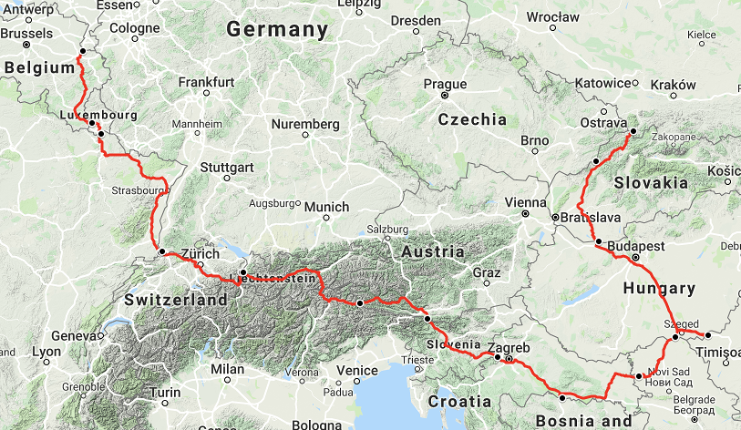
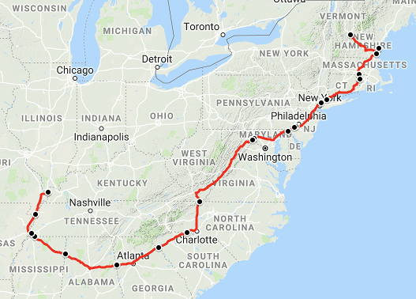
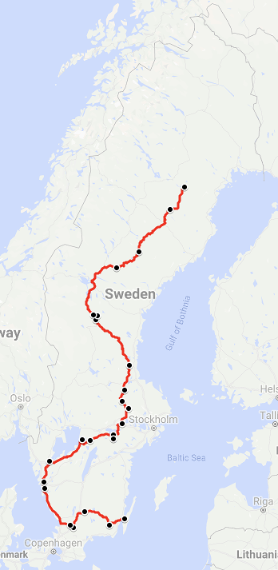
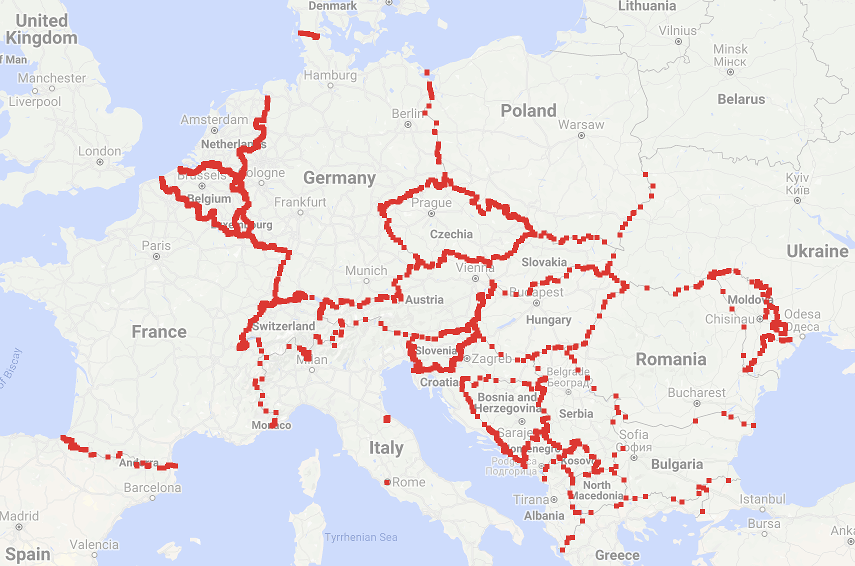

# Regional Traveling Salesman Problem

A program that calculates how to visit a number of regions (countries, states, etc)
by car in the shortest possible time, or visiting as many regions as possible in a
fixed amount of time, using OpenStreetMap data and Google Directions API.

This program was used to calculate the optimal route to visit 18 countries in Europe in
24 hours:

 
<i>
Map data: GeoBasis-DE/BKG, Google, Inst. Geogr. Nacional
 
Netherlands - Belgium - Luxembourg - France - Switzerland - Germany - Liechtenstein -
Austria - Italy - Slovenia - Croatia - Bosnia and Hercegovina - Serbia - Hungary -
Romania - Slovakia - Czechia - Poland
</i>

 

The optimal route to visit 23 US states in 24 hours:

 
<i>
Map data: Google, INEGI
 
Vermont - New Hampshire -
Maine - Massachusetts - Connecticut - Rhode Island - New York - New Jersey - Pennsylvania -
Delaware - Maryland - Virginia - West Virginia - North Carolina - South Carolina -
Georgia - Alabama - Mississippi - Tennessee - Arkansas - Missouri - Illinois - Kentucky
</i>

 

And the optimal route to visit all 25 provinces and 21 counties of Sweden (excluding
the island of Gotland) in 24 hours:

 
<i>
Map data: Google
</i>

 

The program works in three steps:
1. Find all region crossings, by using OpenStreetMap data and searching for intersections
between roads and borders
2. Find the driving time between each relevant pair of region crossings, using Google
Directions API
3. Use a multi-threaded best first search with pruning to find the solution

Example of European border crossings:

 
<i>
Map data: GeoBasis-DE/BKG, Google, Inst. Geogr. Nacional, Mapa GISrael, ORION-ME
</i>

 

_... code to be added ..._
